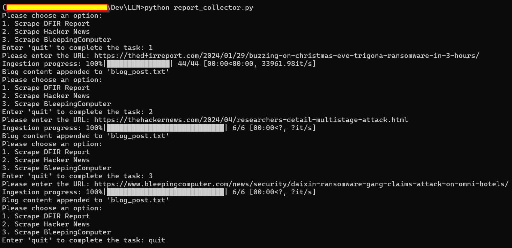

#### This repository contains Python scripts that takes a DIFR Report URL and uses the Locally available models like MIstral in this case and Ollama API to query the report or all reports combined. 

## Features:
1. download x number of reports from a DIFR Report URL (Ref: https://thedfirreport.com/) [Example: https://thedfirreport.com/2024/04/01/from-onenote-to-ransomnote-an-ice-cold-intrusion/]
2. Normalize the text
3. Split the text into chunks
4. Upload the chunks to a `vault.txt`
5. Query the report or all reports combined
6. The embeddings are saved locally in `embeddings.pt`; so if you are just running the query engine you don't end up spending time in retarining the model. 
7. The 'localGPt.py' maintaines a `hash.pid` file that is used to keep track of the differentials as you add or remove reports. 

## Pre-Requisites
1. Insatll Conda (ref: https://docs.conda.io/en/latest/)
2. Install Ollama (ref: https://ollama.com/)

## Set up your environment
```
conda create -n localGPT python=3.11
conda activate localGPT

# if you need to destroy your environment and start over
conda deactivate
conda env remove -n localGPT
```

## Requirements
To run the script, you need to have Python 3.10 installed on your system. You also need to install the different  librarys.

```
pip install -r requirements.txt
```
## Usage
```
## Run the following code and paste the DIFR Report URL you are interested in:
python report_collector.py

## if you konow a bit of python, you can turn this code to be part of localGPT.py
## Run the following code to Normalize, create chunks and upload to 'vault.txt'
python txt_normalizer.py

## Lets make sure Ollama is up and running and for this project we are using Mistral
ollama run mistral

## After the above steps are done, run the following code to query the reports
python localGPT.py
```

## Example
Here's an example of the output that you can expect when running the script:

```
Splitting text into chunks: 100%|██████████| 10/10 [00:00<00:00, 100.00it/s]
Writing chunks to file: 100%|██████████| 10/10 [00:00<00:00, 100.00it/s]
Text file content is appended to vault.txt with each chunk on a separate line. MD5 hash: 09f26e4028e528a10e9f1b8c68e4074b

Ask a question about your documents, or type 'quit' to end the chat: what is the initial access during HTML Smuggling attack ?
Context Pulled from Documents: 


```




## License
This project is licensed under the MIT License.
